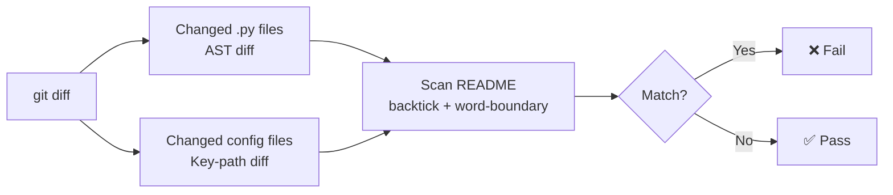

<p align="center">
  
</p>

[](https://pypi.org/project/readme-drift/)
[](https://pypi.org/project/readme-drift/)
[](https://pypi.org/project/readme-drift/)

> Detect stale README references after code changes — for pre-commit and CI.

When you rename a function, change a method signature, remove a class, or rename a key in a config file, `readme-drift` warns you if those names are still referenced in your README — before the commit lands.

---

## How it works



---

## Installation

```bash
pip install readme-drift
```

---

## Usage

### As a pre-commit hook (recommended)

Add to your `.pre-commit-config.yaml`:

```yaml
repos:
  - repo: https://github.com/sachn1/readme-drift
    rev: v1.0.1 # use the latest release
    hooks:
      - id: readme-drift
```

Then install the hook:

```bash
pre-commit install
```

No extra `args` needed — the hook automatically checks your **staged** changes (what you've `git add`-ed). Do not pass `--staged` yourself; it's already set internally and duplicating it will cause an error.

### In CI (GitHub Actions)

```yaml
- name: Check README staleness
  run: readme-drift --base-ref origin/${{ github.base_ref }}
```

CI compares committed changes against a base branch. Do not pass `--staged` here.

### As a CLI tool

```bash
readme-drift --staged                              # check staged changes
readme-drift --base-ref origin/main               # check against a branch
readme-drift --base-ref origin/main --warn-only   # warn but don't fail
```

---

## Configuration

All CLI flags can be set permanently in `pyproject.toml` under `[tool.readme-drift]`.
CLI flags always take precedence over the file. See the [full configuration reference](https://sachn1.github.io/readme-drift/configuration/) for all options.

```toml
[tool.readme-drift]
base-ref = "origin/main"
warn-only = false
include-private = false
plain-text-search = true
min-symbol-length = 4
exclude = ["generated/", "tests/"]
symbol-allowlist = ["MyPublicClass"]
symbol-denylist = ["_internal"]
noise-blocklist = ["run", "build"]   # replaces built-in default; [] disables
noise-allowlist = ["run"]            # remove words from built-in (use instead of noise-blocklist)
readme-paths = []                    # explicit list; empty = auto-discover
readme-exclude-dirs = []
```

| Key | CLI flag | Default |
|---|---|---|
| `base-ref` | `--base-ref` | `"HEAD"` |
| `warn-only` | `--warn-only` | `false` |
| `include-private` | `--include-private` | `false` |
| `plain-text-search` | `--plain-text-search` / `--no-plain-text-search` | `true` |
| `min-symbol-length` | `--min-symbol-length` | `4` |
| `exclude` | `--exclude` (repeatable) | `[]` |
| `symbol-allowlist` | `--symbol-allowlist` (repeatable) | `[]` |
| `symbol-denylist` | `--symbol-denylist` (repeatable) | `[]` |
| `noise-blocklist` | `--noise-blocklist` (repeatable) | built-in default |
| `noise-allowlist` | `--noise-allowlist` (repeatable) | `[]` |
| `readme-paths` | `--readme-paths` (repeatable) | `[]` (auto-discover) |
| `readme-exclude-dirs` | `--readme-exclude-dirs` (repeatable) | `[]` |

`pyproject.toml` is discovered by walking up from the current directory (or `--repo-root` if set). If no `[tool.readme-drift]` section is present, all defaults apply.

---

## Developer reference

A fully annotated [Jupyter notebook](notebooks/demo.ipynb) walks through each module in depth — AST parsing, signature extraction, config diffing, the README scanner, and the complete end-to-end pipeline without git. Useful for understanding the internals or experimenting with edge cases.

---

## Example output

```
readme-drift: ❌ README.md may be stale:

  • `Client.connect` signature changed: connect(host, port) → connect(url)
    in src/client.py
    referenced in README.md line 42: …call `Client.connect(host, port)` to connect…

  • `build` was removed
    in package.json
    referenced in README.md line 18: …run `npm run build` to compile…

  → Please update the README or run with --no-verify to skip.
```

---

## What it catches

### Python files (`.py`)

| Change | Detected? |
|---|---|
| Function renamed | ✅ old name flagged as removed |
| Function removed | ✅ |
| Method signature changed | ✅ |
| Class removed | ✅ |
| Private symbol changed (`_name`) | ➖ ignored by default (enable with `--include-private`) |
| README updated alongside code | ✅ passes silently |
| No Python files changed | ✅ skipped |

### Config files (`.yml`, `.yaml`, `.json`, `.toml`)

| Change | Detected? |
|---|---|
| Script key removed (`"build"` → gone) | ✅ |
| Job name removed (`build:` → gone) | ✅ |
| Tool section removed (`[tool.black]` → gone) | ✅ |
| Key renamed at same level | ✅ (reported as remove + add) |
| Value changed, key unchanged | ➖ not tracked |

## What it doesn't catch

- Behavioral changes that don't affect the public API or config surface
- Symbols not mentioned in the README

---

## Supported README formats

Any file named `readme` (case-insensitive) with the extension `.md`, `.markdown`, `.rst`, `.txt`, or no extension is scanned. All README files in the repository are discovered recursively, including per-package READMEs in monorepos.

The following directories are never searched:

`.git` · `node_modules` · `venv` · `.venv` · `.tox` · `__pycache__` · `.pytest_cache` · `dist` · `build` · `.mypy_cache`

---

## License

MIT
