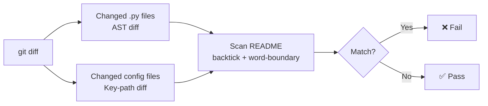

# readme-drift

> Detect stale README references after code changes — for pre-commit and CI.

When you rename a function, change a method signature, remove a class, or rename a key in a config file, `readme-drift` warns you if those names are still referenced in your README — before the commit lands.

---

## How it works



---

## Installation

```bash
pip install readme-drift
```

---

## Usage

### As a pre-commit hook (recommended)

Add to your `.pre-commit-config.yaml`:

```yaml
repos:
  - repo: https://github.com/sachn1/readme-drift
    rev: v0.2.0
    hooks:
      - id: readme-drift
```

Then install the hook:

```bash
pre-commit install
```

Every `git commit` that changes `.py`, `.yml`, `.yaml`, `.json`, or `.toml` files will now check if the README needs updating.

### As a CLI tool

```bash
# Check staged changes (same as pre-commit)
readme-drift --staged

# Check against a specific branch (for CI / PRs)
readme-drift --base-ref origin/main

# Warn only — don't fail the build
readme-drift --base-ref origin/main --warn-only
```

### In CI (GitHub Actions)

```yaml
- name: Check README staleness
  run: readme-drift --base-ref origin/${{ github.base_ref }}
```

---

## Developer reference

A fully annotated [Jupyter notebook](notebooks/demo.ipynb) walks through each module in depth — AST parsing, signature extraction, config diffing, the README scanner, and the complete end-to-end pipeline without git. Useful for understanding the internals or experimenting with edge cases.

---

## Example output

```
readme-drift: ❌ README.md may be stale:

  • `Client.connect` signature changed: connect(host, port) → connect(url)
    in src/client.py
    referenced in README.md line 42: …call `Client.connect(host, port)` to connect…

  • `build` was removed
    in package.json
    referenced in README.md line 18: …run `npm run build` to compile…

  → Please update the README or run with --no-verify to skip.
```

---

## What it catches

### Python files (`.py`)

| Change | Detected? |
|---|---|
| Function renamed | ✅ old name flagged as removed |
| Function removed | ✅ |
| Method signature changed | ✅ |
| Class removed | ✅ |
| Private symbol changed (`_name`) | ➖ ignored by design |
| README updated alongside code | ✅ passes silently |
| No Python files changed | ✅ skipped |

### Config files (`.yml`, `.yaml`, `.json`, `.toml`)

| Change | Detected? |
|---|---|
| Script key removed (`"build"` → gone) | ✅ |
| Job name removed (`build:` → gone) | ✅ |
| Tool section removed (`[tool.black]` → gone) | ✅ |
| Key renamed at same level | ✅ (reported as remove + add) |
| Value changed, key unchanged | ➖ not tracked |

## What it doesn't catch

- Behavioral changes that don't affect the public API or config surface
- Symbols not mentioned in the README

---

## Supported README formats

Any file named `readme` (case-insensitive) with the extension `.md`, `.markdown`, `.rst`, `.txt`, or no extension is scanned. All README files in the repository are discovered recursively, including per-package READMEs in monorepos.

The following directories are never searched:

`.git` · `node_modules` · `venv` · `.venv` · `.tox` · `__pycache__` · `.pytest_cache` · `dist` · `build` · `.mypy_cache`

---

## License

MIT
