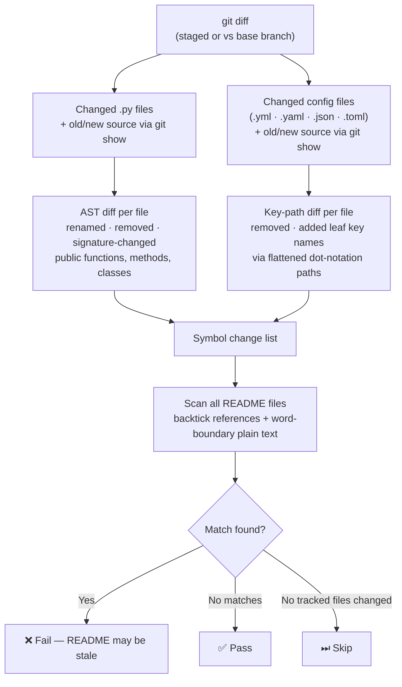
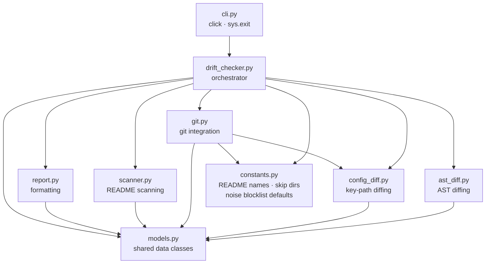
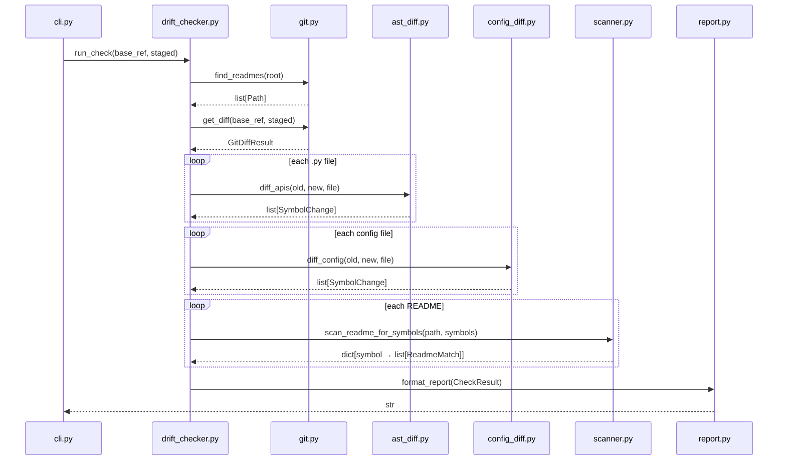

# Architecture

`readme-drift` detects stale README references after code changes. When a public symbol — a function, method, or class — is renamed, removed, or has its signature changed, or when a config file key is removed or renamed, the tool warns if that name is still referenced in a README, before the commit lands.

---

## Pipeline

---

## Module overview

---

## Data flow between modules

---

## Key design decisions

**AST-based diffing, not line diffs.**
A line diff produces false positives (e.g. reformatting) and misses renames. Parsing both file versions into ASTs and comparing the public API surface gives signal only when the interface actually changes.

**Key-path diffing for config files.**
Config files are flattened to dot-notation paths (`scripts.build`, `jobs.ci.runs-on`). Changed paths are decomposed into all their named segments, and those segments are cross-referenced against the full opposite-side key set. This correctly surfaces intermediate key names (`black`, `build`, `ci`) that the README is likely to mention, while ignoring structural parents (`tool`, `jobs`, `scripts`) that survive in the new version.

**Public symbols only.**
Names starting with `_` are ignored. Internal implementation changes are not the README's concern.

**Rename detection (deferred).**
Rename detection for both Python symbols and config keys is not yet implemented. A renamed function appears as a removal (flagged if the old name is in the README) plus an addition (never flagged). The "same parameters = rename" heuristic was found to produce too many false positives for zero-parameter functions or unrelated functions with identical signatures. A reliable signal (git-level rename tracking or AST body similarity) is needed before this can be reintroduced. See backlog in the roadmap.

**Leaf-segment deduplication for config.**
When the same key name appears across multiple paths (e.g. `name` in every GitHub Actions job), it is reported at most once. A README reference to `name` is either stale or it isn't — repeating the finding adds no information.

**Recursive README discovery.**
All README files in the repository are found and scanned (excluding `.git`, `node_modules`, `venv`, and other dev-artifact directories). This supports monorepos where each package has its own README. Symlink directories are skipped to prevent cycles.

**A README update does not bypass the check.**
Touching the README in the same diff does not auto-pass. The full scan still runs, and the result is based on whether any changed symbols remain referenced. A correctly updated README naturally produces zero findings and passes; a partially updated one correctly fails.

**Extensible extractor interface.**
New config file types can be added by implementing the `KeyExtractor` protocol (one `extract(content: str) -> dict[str, str]` method) and registering the suffix in `_EXTRACTORS`. No other module needs to change.
