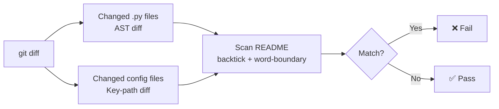

# readme-drift

[](https://pypi.org/project/readme-drift/)
[](https://pypi.org/project/readme-drift/)
[](https://pypi.org/project/readme-drift/)

> Detect stale README references after code changes — for pre-commit and CI.

When you rename a function, change a method signature, remove a class, or rename a key in a config file, `readme-drift` warns you if those names are still referenced in your README — before the commit lands.

## How it works



## Quick start

```bash
pip install readme-drift
```

Add to `.pre-commit-config.yaml`:

```yaml
repos:
  - repo: https://github.com/sachn1/readme-drift
    rev: v3.2.0 # use the latest release
    hooks:
      - id: readme-drift
```

See [Usage → Pre-commit hook](usage/pre-commit.md) for full setup, and [Usage → CI](usage/ci.md) for GitHub Actions integration.

## What it catches

### Python files

| Change | Detected? |
|---|---|
| Function renamed | ✅ old name flagged as removed |
| Function removed | ✅ |
| Method signature changed | ✅ |
| Class removed | ✅ |
| Private symbol changed (`_name`) | ➖ ignored by default (enable with `--include-private`) |
| README updated alongside code | ✅ passes silently |

### Config files (`.yml`, `.yaml`, `.json`, `.toml`)

| Change | Detected? |
|---|---|
| Script key removed | ✅ |
| Job name removed | ✅ |
| Tool section removed | ✅ |
| Key renamed at same level | ✅ reported as remove + add |
| Value changed, key unchanged | ➖ not tracked |

### `Makefile` / `makefile` / `GNUmakefile`

| Change | Detected? |
|---|---|
| Target removed | ✅ |
| Target renamed | ✅ reported as remove + add |
| Recipe body changed, target name unchanged | ➖ not tracked |

## What it doesn't catch

- Behavioral changes that don't affect the public API or config surface
- Symbols not mentioned in the README
